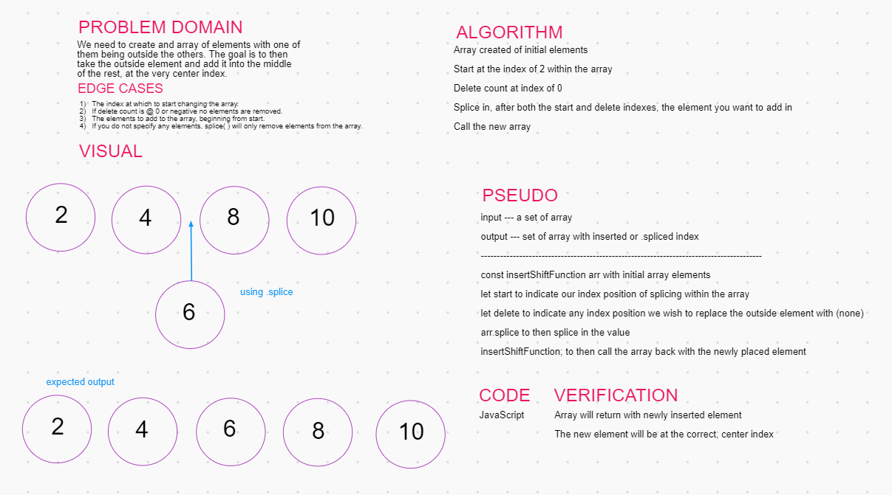

# Array-Shift 
Insert and shift an array in middle at index. 

# Challenge
Write a function called insertShiftArray which takes in an array and the value to be added. Without utilizing any of the built-in methods available to your language, return an array with the new value added at the middle index.

# Approach & Efficiency

identify the start and end of the array (a and d)
shift and insert 'c'
move end forwards by 1

# Solution
<!-- embedded whiteboard image -->

