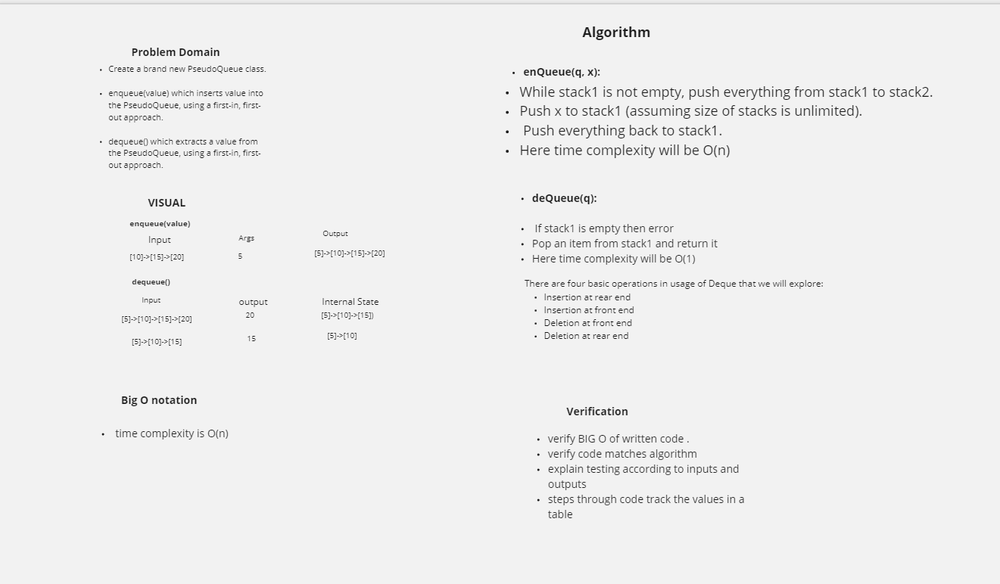

# Challenge Summary
- PseudoQueue

# challenge
- Create a brand new PseudoQueue class. Do not use an existing Queue. Instead, this PseudoQueue class will implement our standard queue interface (the two methods listed below), but will internally only utilize 2 Stack objects. Ensure that you create your class with the following methods:

- enqueue(value) which inserts value into the PseudoQueue, using a first-in, first-out approach.

- dequeue() which extracts a value from the PseudoQueue, using a first-in, first-out approach.

- The Stack instances have only push, pop, and peek methods. You should use your own Stack implementation. Instantiate these Stack objects in your PseudoQueue constructor.

# Approch and Efficiency
enqueue space o(1) time 0(1)
dequeue space: space O(n^2) time : O(n^2)

<!-- embedded whiteboard image -->

for this code challenge I collaborated with Nassir Abegaz 